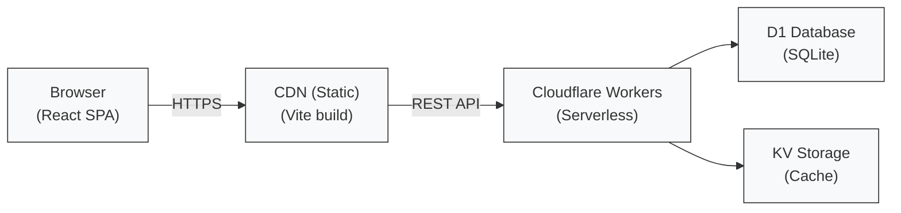

# Feedback Flow


**⭐ If you find this tool useful, please consider giving it a star!**

---

## 📋 Table of Contents

- [Overview](#-overview)
- [Quick Start](#-quick-start)
- [Detailed Installation](#-detailed-installation)
- [User Guide](#-user-guide)
- [Technical Documentation](#-technical-documentation)
- [Production Deployment](#-production-deployment)
- [Contributing](#-contributing)

---

## 🎯 Overview

### What is Feedback Flow?

Feedback Flow is a web application designed to help **product testers** efficiently manage their testing activities and feedback submissions.

### Who is this for?

This application is built for **individual testers** who participate in product testing programs (such as Amazon's Testers Club or similar platforms), where sellers offer free or discounted products in exchange for honest reviews.

**✅ You should use this app if you:**
- Test multiple products simultaneously
- Need to track purchases, feedback, and refunds
- Must provide proof of published reviews to receive refunds
- Want organized records in case of disputes with sellers

**❌ This app is NOT for:**
- Sellers or product managers
- Managing product offers from sellers (out of scope)

### Key Features

- 📦 **Purchase Tracking** - Record all your test product purchases
- ✍️ **Feedback Management** - Document your reviews and opinions
- 📸 **Proof Storage** - Keep screenshots of purchases and published reviews
- 💰 **Refund Monitoring** - Track refund status and amounts
- 🔗 **Dispute Resolution** - Generate public proof links for seller disputes
- 📊 **Statistics Dashboard** - Visualize your testing activity

### The Testing Workflow

Feedback Flow supports the standard product testing process:

1. **Purchase** - Seller offers product; you purchase it
2. **Proof of Purchase** - Upload screenshot to seller
3. **Testing** - Use and evaluate the product
4. **Review** - Write honest feedback
5. **Publication** - Feedback published on platform (e.g., Amazon)
6. **Proof of Review** - Send published review screenshot to seller
7. **Refund** - Receive full or partial refund from seller

### Technology Stack

- **Frontend**: React 19, Vite, Tailwind CSS, HeroUI
- **Backend**: Cloudflare Workers (serverless)
- **Database**: Cloudflare D1 (SQLite)
- **Authentication**: Auth0 (OAuth 2.0)
- **Deployment**: Static SPA on CDN + REST API on Workers

Based on the [Vite, Auth0 & HeroUI Template](https://github.com/sctg-development/vite-react-heroui-auth0-template).

---

## 🚀 Quick Start

### Prerequisites

- Node.js 18+ and npm
- Git
- A GitHub account (for authentication)

### 5-Minute Setup

```bash
# 1. Clone the repository
git clone https://github.com/sctg-development/feedback-flow.git
cd feedback-flow

# 2. Install dependencies
cd cloudflare-worker && npm ci
cd ../client && npm ci

# 3. Set up environment (see Configuration section)
cp .env.example .env
# Edit .env with your settings

# 4. Initialize database with test data
cd cloudflare-worker
npm run d1:create && npm run d1:init && npm test

# 5. Start the application
# Terminal 1 - Backend
cd cloudflare-worker && npm run dev:env

# Terminal 2 - Frontend
cd client && npm run dev:env

# 6. Open http://localhost:5173
```

---

## 📥 Detailed Installation

### Step 1: Clone and Install Dependencies

```bash
git clone https://github.com/sctg-development/feedback-flow.git
cd feedback-flow

# Install backend dependencies
cd cloudflare-worker
npm ci

# Install frontend dependencies
cd ../client
npm ci
```

### Step 2: Configure Auth0

Feedback Flow uses Auth0 for authentication. You'll need to:

1. **Create an Auth0 account** at [auth0.com](https://auth0.com)
2. **Set up an Application** (Single Page Application type)
3. **Configure Social Connections** (enable GitHub login)
4. **Create an API** for backend authentication
5. **Set up permissions** in your API

Detailed Auth0 configuration instructions are available in [Auth0.md](https://github.com/sctg-development/feedback-flow/blob/main/Auth0.md).

### Step 3: Environment Configuration

Create a `.env` file in the **root directory** with the following structure:

```bash
# ========================================
# AUTH0 CONFIGURATION
# ========================================
AUTH0_CLIENT_ID=your_auth0_client_id
AUTH0_CLIENT_SECRET=your_auth0_client_secret
AUTH0_MANAGEMENT_API_CLIENT_ID=your_management_api_client_id
AUTH0_MANAGEMENT_API_CLIENT_SECRET=your_management_api_secret
AUTH0_DOMAIN=your-domain.eu.auth0.com
AUTH0_SCOPE="openid profile email read:api write:api admin:api backup:api"
AUTH0_AUDIENCE="http://localhost:8787/api"
AUTH0_SUB=github|your_github_user_id

# ========================================
# API CONFIGURATION
# ========================================
API_BASE_URL=http://localhost:8787/api
CORS_ORIGIN=http://localhost:5173

# ========================================
# PERMISSIONS
# ========================================
READ_PERMISSION=read:api
WRITE_PERMISSION=write:api
ADMIN_PERMISSION=admin:api
ADMIN_AUTH0_PERMISSION=auth0:admin:api
BACKUP_PERMISSION=backup:api
SEARCH_PERMISSION=search:api

# ========================================
# APPLICATION SETTINGS
# ========================================
CRYPTOKEN=your_random_encryption_key_here
STATISTICS_LIMIT=100
DB_BACKEND=d1
DB_MAX_IMAGE_SIZE=640
AMAZON_BASE_URL="https://www.amazon.fr/gp/your-account/order-details?orderID="

# ========================================
# AUTHENTICATION TOKEN (for testing)
# ========================================
# Get this token by logging into the app and clicking your name in the footer
AUTH0_TOKEN="your_jwt_token_here"
```

### Step 4: Initialize Database with Test Data

To populate your development environment with realistic sample data:

```bash
cd cloudflare-worker
npm run d1:create && npm run d1:init && npm test
```

This creates:
- Sample purchases with various dates and amounts
- Feedback entries linked to purchases
- Publication records with screenshots
- Refund transactions
- Different purchase states (pending, published, refunded)

### Step 5: Get Your Authentication Token

1. Start the application (see Step 6)
2. Open [http://localhost:5173](http://localhost:5173)
3. **Log in with your GitHub account**
4. Click on **your name in the footer**
5. **Copy the JWT token** from the modal
6. Paste it in your `.env` file as `AUTH0_TOKEN`
7. **Restart the Cloudflare Worker**

### Step 6: Run the Application

Open two terminal windows:

**Terminal 1 - Backend:**
```bash
cd cloudflare-worker
npm run dev:env
```

**Terminal 2 - Frontend:**
```bash
cd client
npm run dev:env
```

**Access the application:**
- Frontend: [http://localhost:5173](http://localhost:5173)
- Backend API: [http://localhost:8787](http://localhost:8787)
- API Documentation: [http://localhost:8787/docs](http://localhost:8787/docs)

---

## 📖 User Guide

### Understanding Permissions

Feedback Flow uses a role-based permission system:

| Permission | Description |
|------------|-------------|
| `read:api` | View your own feedback data |
| `write:api` | Create and update your feedback data |
| `search:api` | Search across feedback data |
| `admin:api` | Administer users and testers |
| `auth0:admin:api` | Manage Auth0 users |
| `backup:api` | Backup and restore database |

### User Workflows

#### Regular Tester Workflow

**1. Add a New Purchase**
- Navigate to the main page
- Click **"Add Purchase"**
- Fill in: product name, order number, purchase date, amount
- Upload screenshot of purchase confirmation
- Save

**2. Submit Feedback**
- Find your purchase in the list
- Click **"Add Feedback"**
- Write your honest review
- Save feedback draft

**3. Publish Your Review**
- Publish your review on the required platform (e.g., Amazon)
- Return to Feedback Flow
- Click **"Publish Feedback"**
- Upload screenshot of published review
- Mark as published

**4. Request and Record Refund**
- Generate a PDF report for the seller (optional)
- Send proof to seller
- When refund is received, click **"Add Refund"**
- Enter refund amount and date

#### Administrator Workflow

**Managing Users and Testers**

Admins can access the **Users & Permissions** page to:

- **View all Auth0 users** with their assigned testers
- **Create new testers** and assign OAuth IDs
- **Assign/unassign users** to testers (single or bulk operations)
- **Delete users** (automatically unassigns them first)

**Creating a Tester:**
1. Navigate to Users & Permissions
2. Click **"Create Tester"**
3. Enter tester name
4. Select one or more OAuth IDs to assign
5. Save

**Assigning Users to Testers:**
1. Select user(s) in the table
2. Click **"Assign"**
3. Choose existing tester
4. Confirm assignment

### Using the API

The REST API is documented with Swagger UI at [/docs](https://sctg-development.github.io/feedback-flow/docs).

**Authentication:**
1. Log into the application
2. Click your name in the footer
3. Copy the JWT token
4. In Swagger UI, click **"Authorize"**
5. Paste token with `Bearer ` prefix: `Bearer your_token_here`

The token is valid for 24 hours.

### Generating Dispute Resolution Links

If you need to prove your testing activity to a seller:

1. Select the purchase in question
2. Click **"Generate Public Link"**
3. Share the link with the seller
4. The link provides read-only access to:
   - Purchase proof
   - Published review screenshot
   - All relevant dates and information

---

## 🔧 Technical Documentation

### Architecture Overview


### Database Schema

The application stores:
- **Testers**: User profiles with OAuth ID mappings
- **Purchases**: Product orders with dates and amounts
- **Feedback**: Review text and submission dates
- **Publications**: Published review proofs
- **Refunds**: Refund amounts and dates
- **Screenshots**: Base64 encoded images

### API Documentation

All REST API endpoints are automatically documented with **Swagger UI**:

🔗 **[Interactive API Documentation](https://sctg-development.github.io/feedback-flow/docs)**

The Swagger UI provides:
- Complete endpoint documentation
- Request/response schemas
- Interactive testing interface
- Authentication examples

### Security Model

**Authentication Flow:**
1. User logs in via Auth0 (OAuth 2.0)
2. Browser receives JWT token
3. Token sent to API in `Authorization: Bearer <token>` header
4. API verifies token signature and permissions
5. Access granted or denied based on token claims

**Permission Enforcement:**
- All endpoints require valid JWT
- Permissions checked on every request
- Users can only access their own data (except admins)
- Admin endpoints require `admin:api` permission

### Development Scripts

**Backend (cloudflare-worker/):**
```bash
npm run dev:env          # Start dev server with .env
npm run d1:create        # Create local D1 database
npm run d1:init          # Initialize schema
npm run d1:migrate:all   # Run migrations
npm test                 # Run tests + populate test data
```

**Frontend (client/):**
```bash
npm run dev:env          # Start dev server with .env
npm run build            # Build for production
npm run preview          # Preview production build
```

### Testing

The test suite includes:
- End-to-end API tests
- Database operation tests
- Authentication flow tests
- Permission enforcement tests

Run tests with:
```bash
cd cloudflare-worker
npm test
```

---

## 🌐 Production Deployment

### Deploying to Cloudflare (Free Tier)

Feedback Flow can be deployed entirely on Cloudflare's free tier.

#### Prerequisites

1. **Cloudflare Account** - Sign up at [dash.cloudflare.com](https://dash.cloudflare.com/)
2. **Wrangler CLI** - Install globally: `npm install -g wrangler`
3. **GitHub Repository** - Fork or use the original repo

#### Step 1: Create Cloudflare Resources

**A. Sign in to Cloudflare via Wrangler:**
```bash
npx wrangler login
```

**B. Create KV Namespace (for caching):**
```bash
npx wrangler kv:namespace create "KV_CACHE"
```
Copy the returned namespace ID to `wrangler.jsonc`.

**C. Create D1 Database:**
```bash
npx wrangler d1 create feedbackflow-db
```
Copy the returned database ID to `wrangler.jsonc`.

**D. Initialize Remote Database:**
```bash
cd cloudflare-worker
npm run d1:create:remote
npm run d1:migrate:all:remote
```

#### Step 2: Configure GitHub Secrets

Navigate to your repository: **Settings → Secrets and variables → Actions**

**Required Secrets:**
- `CLOUDFLARE_API_TOKEN` (Workers/D1/KV edit permissions)
- `CLOUDFLARE_ACCOUNT_ID`
- `AUTH0_DOMAIN`
- `AUTH0_CLIENT_ID`
- `AUTH0_CLIENT_SECRET`
- `AUTH0_MANAGEMENT_API_CLIENT_ID`
- `AUTH0_MANAGEMENT_API_CLIENT_SECRET`
- `AUTH0_AUDIENCE`
- `API_BASE_URL` (your production URL)
- `CORS_ORIGIN` (your frontend URL)
- `PAYPAL_TRANSACTION_BASE_URL`

**Required Variables:**
- `AUTH0_SCOPE`
- `READ_PERMISSION`
- `WRITE_PERMISSION`
- `ADMIN_PERMISSION`
- `SEARCH_PERMISSION`
- `ADMIN_AUTH0_PERMISSION`
- `BACKUP_PERMISSION`
- `DB_BACKEND` (set to `d1`)
- `DB_MAX_IMAGE_SIZE`
- `AMAZON_BASE_URL`
- `STATISTICS_LIMIT`

#### Step 3: Deploy via GitHub Actions

The repository includes a deployment workflow: `.github/workflows/deploy-cloudflare-worker.yaml`

**Trigger deployment:**
- **Automatic**: Push to `main` branch
- **Manual**: Actions tab → CloudflareWorkerDeploy → Run workflow

#### Step 4: Verify Deployment

1. Check the Worker URL in Cloudflare dashboard
2. Test API endpoints: `GET /api/testers`
3. Deploy frontend to your preferred CDN
4. Update Auth0 callback URLs with production URLs

### Deploying the Frontend

The frontend is a static SPA that can be deployed to:

- **Cloudflare Pages** (recommended)
- Vercel
- Netlify
- Any static hosting service

**Build the frontend:**
```bash
cd client
npm run build
```

Deploy the `dist/` folder to your hosting provider.

### For Forked Repositories

If you fork this repository:

1. **Enable GitHub Actions** in your fork
2. **Create all secrets and variables** as listed above
3. **Update `wrangler.jsonc`** with your resource IDs
4. **Push to trigger deployment**

---

## 🤝 Contributing

Contributions are welcome! Please:

1. Fork the repository
2. Create a feature branch: `git checkout -b feature/your-feature`
3. Commit changes: `git commit -m 'Add your feature'`
4. Push to branch: `git push origin feature/your-feature`
5. Open a Pull Request

### Development Guidelines

- Follow existing code style
- Add tests for new features
- Update documentation as needed
- Keep commits focused and atomic

---

## 📸 Screenshots

### Main Dashboard


### Read-Only User View


### Add Purchase Form


### Add Feedback Form


### Publish Feedback Dialog


### Statistics Dashboard


### PDF Report Generation


### Add Refund Form


### Admin - Add User (Dark Mode)


### API Documentation


---

## 📄 License

MIT License - see [LICENSE](LICENSE.md) file for details.

## 🔗 Links

- **Documentation**: [sctg-development.github.io/feedback-flow/docs](https://sctg-development.github.io/feedback-flow/docs)
- **Template**: [Vite, Auth0 & HeroUI Template](https://github.com/sctg-development/vite-react-heroui-auth0-template)
- **Issues**: [GitHub Issues](https://github.com/sctg-development/feedback-flow/issues)

---

**Made with ❤️ by the SCTG Development team**